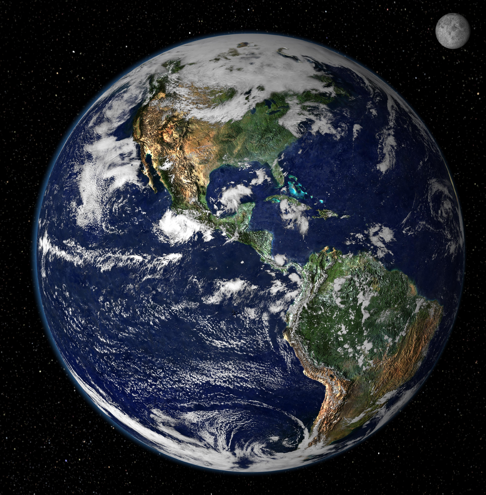
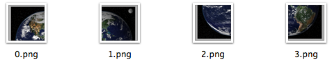

# tily.rb
*Map tile generator with ruby.*

## Status
[](https://travis-ci.org/void-main/tily.rb)
[](http://badge.fury.io/rb/tily.rb)

## Introduction
There are times when you want to display a really huge image in your mobile app, but we all know that it's not possible to load the whole image in the app, it will simply consume up the memory. Now, consider these map apps like Google Maps, they took the strategy of spliting the image into levels. In each level, the image is divided into small tiles, which makes it possible to load in your phone. Why can't we display huge images like this?

To implement the tile-based image display view, the very first step is preprocessing the huge image, spliting it into small tiles, that's what [tily.rb](https://github.com/void-main/tily.rb) does.

## Demonstration
To help you understand tily better, I'll give you a simple example. The following picture is an overview of the earth, imagine that we want to display this image in our app.


This size of this image is 3824 x 3904 in pixel. This image is not quite huge, but big enough for a demonstration.

>Note: The image is taken from [http://www.mapadaamerica.com/](http://www.mapadaamerica.com/), the url of the image is [http://www.mapadaamerica.com/attachments/Image/el-mundo.jpg](http://www.mapadaamerica.com/attachments/Image/el-mundo.jpg)

Tily.rb follows the introduction of [Bing Maps Tile System](http://msdn.microsoft.com/en-us/library/bb259689.aspx), which splits the image into different levels, and in each level, divide the scaled image into small tiles. The default tile size if 256 x 256 in pixel, but this is configurable. 

Also note that, neither 3824 nor 3904 can be divided with no remainder by 256, so tily needs to enlarge the image size into `tileSize * (2 ** level)`, where `level` is `ceil(log2(imageSize/tileSize))`. 

After this, the images will be divied, and here's the folder structure of the splited tiles.

```
$  tree
.
├── 1
│   ├── 0.png
│   ├── 1.png
│   ├── 2.png
│   └── 3.png
├── 2
│   ├── 00.png
│   ├── 01.png
│   ├── 02.png
│   ├── 03.png
│   ├── 10.png
│   ├── 11.png
│   ├── 12.png
│   ├── 13.png
│   ├── 20.png
│   ├── 21.png
│   ├── 22.png
│   ├── 23.png
│   ├── 30.png
│   ├── 31.png
│   ├── 32.png
│   └── 33.png
├── 3
│   ├── 000.png
│   ├── 001.png
│   ├── 002.png
│   ├── 003.png
│   ├── 010.png
│   ├── 011.png
│   ├── 012.png
│   ├── 013.png
… more images
└── meta.json
```

The tile images are named after their `quadKeys`, for more information of quadkey, check the introduction of [Bing Maps Tile System](http://msdn.microsoft.com/en-us/library/bb259689.aspx). 

As for the tile images, take layer 1 for example, here's what it looks like:


Now, you should know what tily does.

## Installation
### Prerequisites
- tily.rb is bundled as a ruby gem. Therefore, ruby is required. We've tested tily.rb on Ruby 2.0.
- tily.rb takes advantage of [ImageMagick](http://www.imagemagick.org/script/index.php), download the corresponding binary releases according to your operating system.

### Do installation
It's easy, just type `gem install tily.rb` in terminal, and it should be installed in your box.

### One gem for two types of users
On one hand, if you simply wants to use tily.rb, it's easy. tily.rb provides a simple tool named `tily`, once you've installed tily.rb gem, the tool is ready for you. For the usage of this command, type `tily -h` in terminal.

On the other hand, tily.rb is a library as well, who that takes a huge image as input, and put the processed images to the target folder. If you are a developer who wants to take advantages of tile-image generation, go ahead and check the [rdoc of the gem](http://rubydoc.info/gems/tily.rb/0.1.4/frames) or the [source](https://github.com/void-main/tily.rb/blob/master/bin/tily) of our `tily` tool.

## tily.rb is not alone
tily.rb seems quite useless by itself, when combined with UI controls, these images will be displayed amazingly.

We've created an android project named [aTily](https://github.com/void-main/aTily) to display the tiled-image, be sure to check it out please.